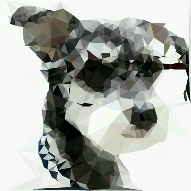

# LowPoly

LowPoly on Android. Convert a picture into LowPoly style. It has two steps to finish this process. First use Sobel operator to get the edge on image, then use Delaunay Triangulation to generate triangles from these edge points and some random points. Finally fill color on these triangles, we will get the LowPoly style picture.

## Download

```
dependencies {
    compile 'me.fichardu.lowpoly:lowpoly:1.0.1'
}
```

## Usage

Two ways:

1. LowPoly.getLowPolyBitmap(Bitmap bitmap, int accuracy, int randomPointCount);

	This will Convert a bitmap into LowPoly style bitmap directly.
	
2. LowPoly.lowPoly(int[] pixels, int width, int height, int accuracy, int pointCount);

	This will generate Delaunay Triangles from the given bitmap`s pixels. Then you can use these triangles to draw on canvas.

## Shot




## Thanks

- The original idea from here `https://github.com/zzhoujay/LowPoly`
- The original Delaunay algorithm implement from here `http://paulbourke.net/papers/triangulate/`

## Licence

	Copyright 2017 Fichardu
	
	Licensed under the Apache License, Version 2.0 (the "License");
	you may not use this file except in compliance with the License.
	You may obtain a copy of the License at
	
	    http://www.apache.org/licenses/LICENSE-2.0
	
	Unless required by applicable law or agreed to in writing, software
	distributed under the License is distributed on an "AS IS" BASIS,
	WITHOUT WARRANTIES OR CONDITIONS OF ANY KIND, either express or implied.
	See the License for the specific language governing permissions and
	limitations under the License.